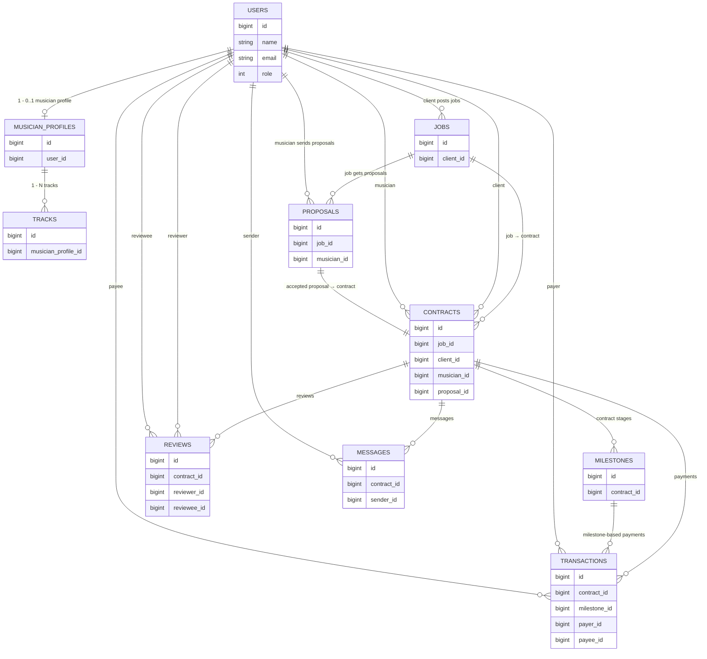

## 🎼 ER Diagram — Music Matching System (Mermaid)

```mermaid
erDiagram

  USERS {
    bigint id
    string name
    string email
    int role
  }

  MUSICIAN_PROFILES {
    bigint id
    bigint user_id
  }

  TRACKS {
    bigint id
    bigint musician_profile_id
  }

  JOBS {
    bigint id
    bigint client_id
  }

  PROPOSALS {
    bigint id
    bigint job_id
    bigint musician_id
  }

  CONTRACTS {
    bigint id
    bigint job_id
    bigint client_id
    bigint musician_id
    bigint proposal_id
  }

  MILESTONES {
    bigint id
    bigint contract_id
  }

  TRANSACTIONS {
    bigint id
    bigint contract_id
    bigint milestone_id
    bigint payer_id
    bigint payee_id
  }

  REVIEWS {
    bigint id
    bigint contract_id
    bigint reviewer_id
    bigint reviewee_id
  }

  MESSAGES {
    bigint id
    bigint contract_id
    bigint sender_id
  }

  %% --------------------
  %% Relations
  %% --------------------

  USERS ||--o| MUSICIAN_PROFILES : "1 - 0..1 musician profile"
  MUSICIAN_PROFILES ||--o{ TRACKS : "1 - N tracks"

  USERS ||--o{ JOBS : "client posts jobs"

  JOBS ||--o{ PROPOSALS : "job gets proposals"
  USERS ||--o{ PROPOSALS : "musician sends proposals"

  JOBS ||--o{ CONTRACTS : "job → contract"
  USERS ||--o{ CONTRACTS : "client"
  USERS ||--o{ CONTRACTS : "musician"
  PROPOSALS ||--|| CONTRACTS : "accepted proposal → contract"

  CONTRACTS ||--o{ MILESTONES : "contract stages"
  CONTRACTS ||--o{ TRANSACTIONS : "payments"
  MILESTONES ||--o{ TRANSACTIONS : "milestone-based payments"

  USERS ||--o{ TRANSACTIONS : "payer"
  USERS ||--o{ TRANSACTIONS : "payee"

  CONTRACTS ||--o{ REVIEWS : "reviews"
  USERS ||--o{ REVIEWS : "reviewer"
  USERS ||--o{ REVIEWS : "reviewee"

  CONTRACTS ||--o{ MESSAGES : "messages"
  USERS ||--o{ MESSAGES : "sender"
```
